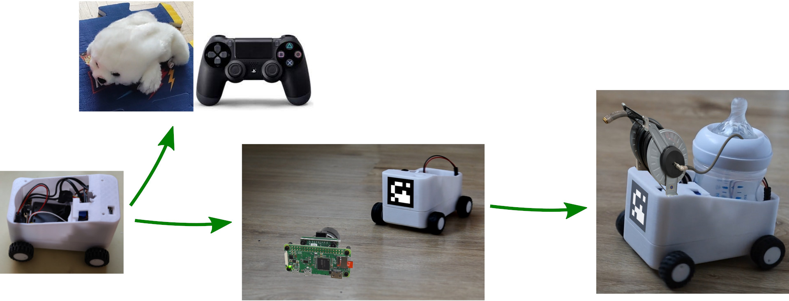
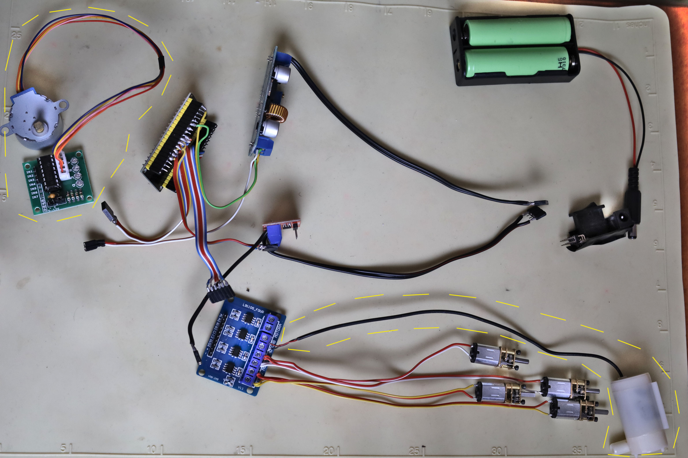
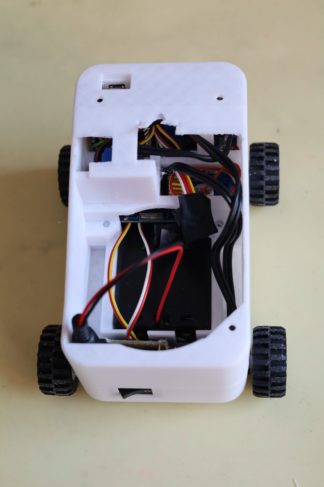

# water_carrier
A simple trail car for carrying liquids to be used by other robots.

## Objective
This is the first and simplest part of my larger conceptual project of a pipeless system that takes care of household (and possibly garden) plants at times when their owners are not at home. Currently the whole project is quite far from being complete, but you can find a simple working watering device [here](https://github.com/afrixs/plant-guard)

## Roadmap

 * Bluetooth-controlled robot body (Done)
 * [Gamepad-controlled toy](esp32/gamepad_toy/README.md) (Done)
 * Camera follower
 * Water carrier with a hose reel which can be controlled and used by other robots
 * Charging system, low battery alerts

### Current state
[](https://www.youtube.com/watch?v=3kib8IhLip0)

## Shopping list
Giving links to sellers in Slovak/Czech market since I bought them here, but you can certainly find similar (or same) models and easily edit the corresponding dimensions in FreeCAD.

| Item                                                               | Link                                                                                                                                         | Comment                                                                                                                  |
|--------------------------------------------------------------------|----------------------------------------------------------------------------------------------------------------------------------------------|--------------------------------------------------------------------------------------------------------------------------|
| ESP32                                                              | [GME](https://www.gme.sk/v/1508256/esp-32s-24ghz-dual-mode-wifibluetooth)                                                                    |                                                                                                                          |
| Voltage changer                                                    | [GME](https://www.gme.sk/v/1508405/modul-dc-dc-menic-step-down-125-32v-5a)                                                                   |                                                                                                                          |
| DC Motors                                                          | [Techfun](https://techfun.sk/produkt/dc-motorcek-s-prevodom-rozne-typy/) [AliExpress](https://www.aliexpress.com/item/1005001340092317.html) | I used 6V/100RPM                                                                                                         |
| DC Motors driver                                                   | [Techfun](https://techfun.sk/produkt/l9110s-dc-motor-driver-pre-4-motory/)                                                                   | L9110S for 4 motors (2 for wheels, 1 for water pump)                                                                     |
| Battery case                                                       | [GME](https://www.gme.sk/v/1506743/tg218650-dc21-drziak-baterie-2x18650)                                                                     |                                                                                                                          |
| Batteries                                                          | [GME](https://www.gme.sk/v/1507017/panasonic-18650-li-ion-2900mah-akumulator)                                                                | 2x 18650 Li-ion 2900mAh                                                                                                  |
| Voltage/current detection module                                   | [GME](https://www.gme.sk/v/1507727/modul-merania-napatia-a-prudu-0-3a-a-3-25v)                                                               | In practice just a simple voltage divider is needed for low-battery alerts (which are not implemented yet by the way...) |
| + Power switch, connectors, cables, header strips ... (see photos) |                                                                                                                                              |                                                                                                                          |
| Screws                                                             |                                                                                                                                              | M3x8 Flat-head (4 for wheel tightening), M3x12 Flat-head + M3 nuts, 8x M1.6x4* (for holding wheel motors)                |
| Wheels                                                             | [Lego](https://www.lego.com/en-us/product/telehandler-42133)                                                                                 | Lego wheels with 30.4mm diameter were used                                                                               |

*Can be found in old cell-phones or maybe in laptops (also can be bought in some RC shops for 1 euro per screw :D). They need to be shorter than 5mm to avoid contact with gears (can be shortened by a file). Or a support part can be designed to hold the motors without screws - contributions are welcome.

<figure>
  
  <figcaption>Electronics used for robot. Yellow-dashed area - needed for next version (with hose reel + water pump + [water level sensor](https://www.hackster.io/mircemk/arduino-liquid-level-meter-with-simple-homemade-sensor-191413))</figcaption>
</figure>

<figure>
  
  <figcaption>Assembled water_carrier robot v0.1</figcaption>
</figure>

## Installation
 * Set path to your `water_carrier/esp32` folder in *File -> Preferences -> Sketchbook location*
 * Add following to *File -> Preferences -> Additional boards manager* in your Arduino IDE
```
https://raw.githubusercontent.com/espressif/arduino-esp32/gh-pages/package_esp32_index.json
https://raw.githubusercontent.com/ricardoquesada/esp32-arduino-lib-builder/master/bluepad32_files/package_esp32_bluepad32_index.json
```
 * In *Tools -> Board -> Boards Manager* install *esp32* and *esp32_bluepad32* and select corresponding board in *Tools -> Board*, e.g.
   * *esp32 -> ESP32 Dev Module* for *water_carrier* 
   * *esp32_bluepad32 -> ESP32 Dev Module* for *gamepad_toy*
 * In *File -> Sketchbook* select *water_carrier* or *gamepad_toy*
 * Upload to your ESP32
 * For *water_carrier* control you can use a simple ROS2 [trail_control](ros/trail_control) node in combination with e.g. `ros2 run teleop_twist_keyboard teleop_twist_keyboard`
