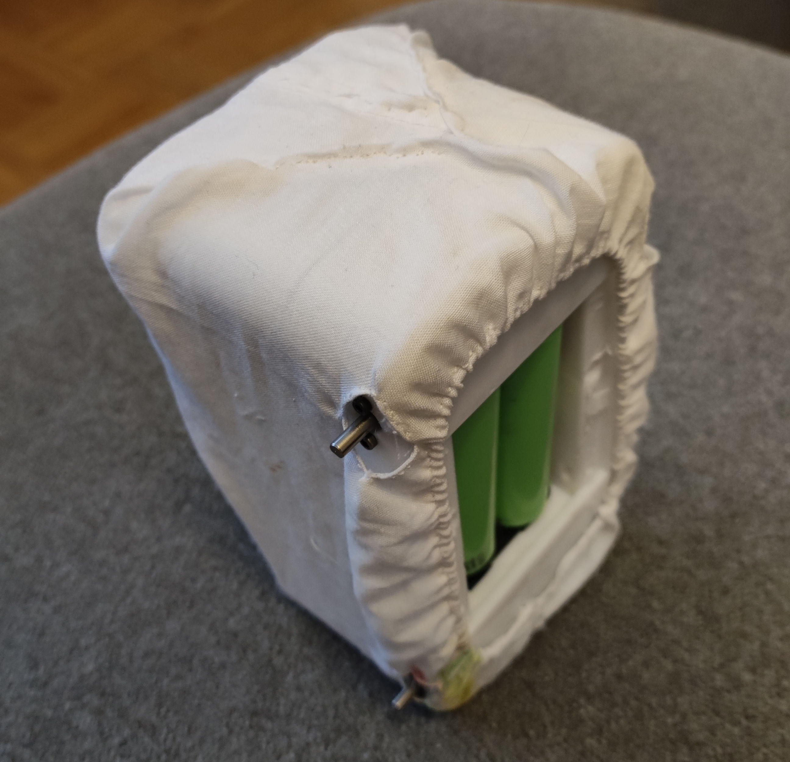
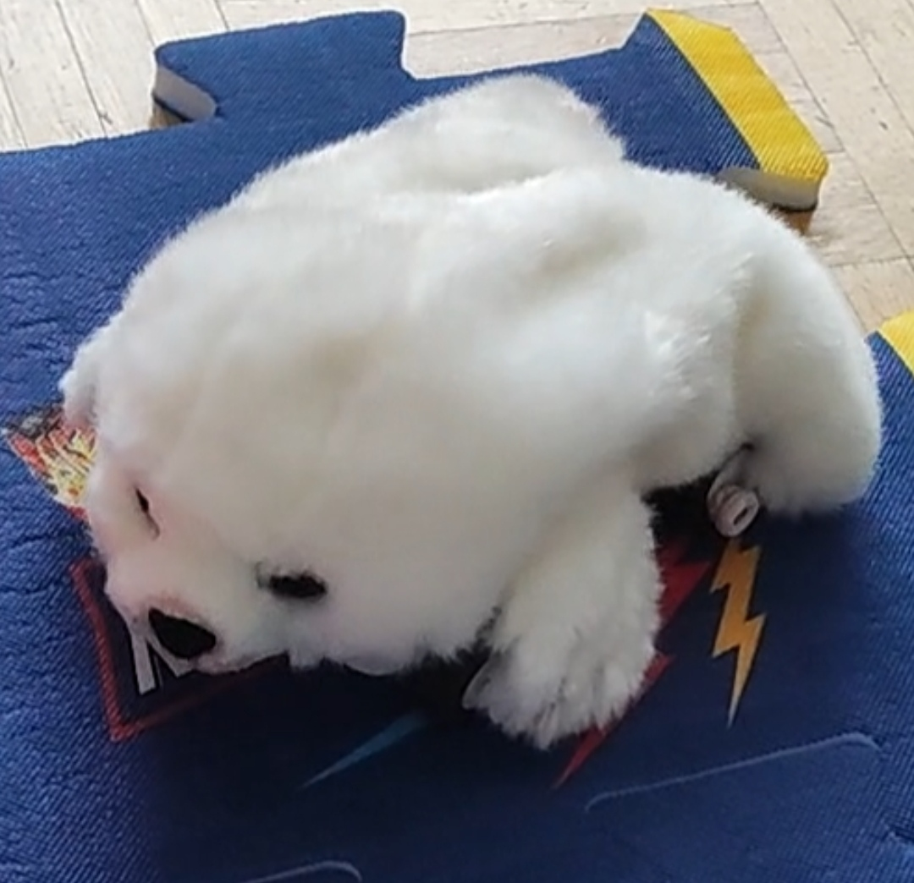
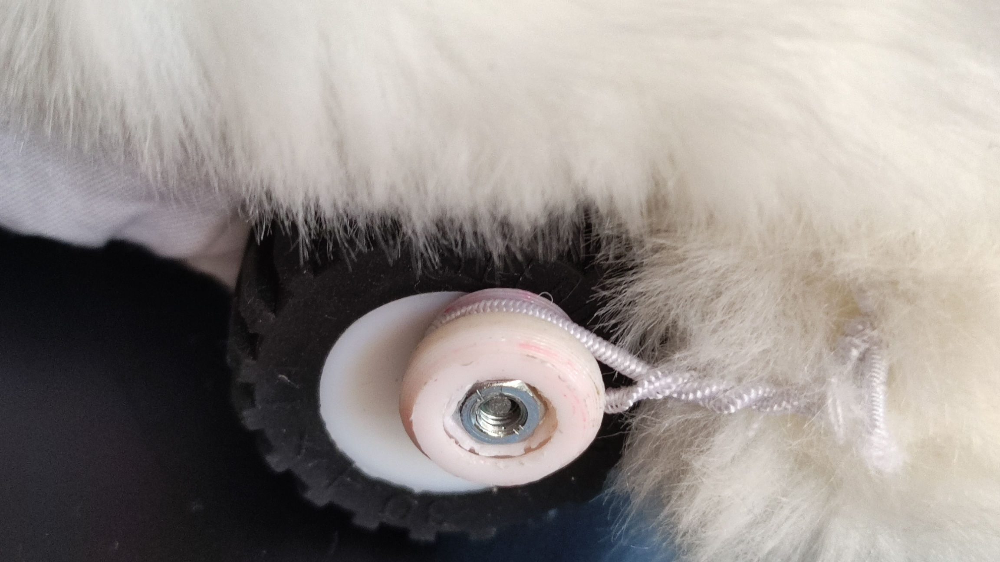

# Stuffed seal
A gamepad-controlled toy 

## Objective
A large-scale DIY project needs some nice checkpoints on the road and this is one of them -
a cute stuffed toy for my daughter

## Manufacturing technique
It was just a long-lasting relaxing handwork, so there is not too much
work I can spare you from, so I'll just add steps of my work:
 * sewing a coat for [water_carrier](../../README.md) robot with an elastic band and holes for wheels
   

 * unstitching a stuffed animal toy (I used a seal, but maybe something as fat but with longer legs would be better,
   e.g. a hippo or a pig, so that the movement is clearer and motors are not burdened too much)
   and sewing it onto the coat
   

 * sewing rubber bands onto the feet of the toy and fixing them to the
   [LegConnectors](../../models/water_carrier-LegConnector.3mf) mounted on the wheels
   
