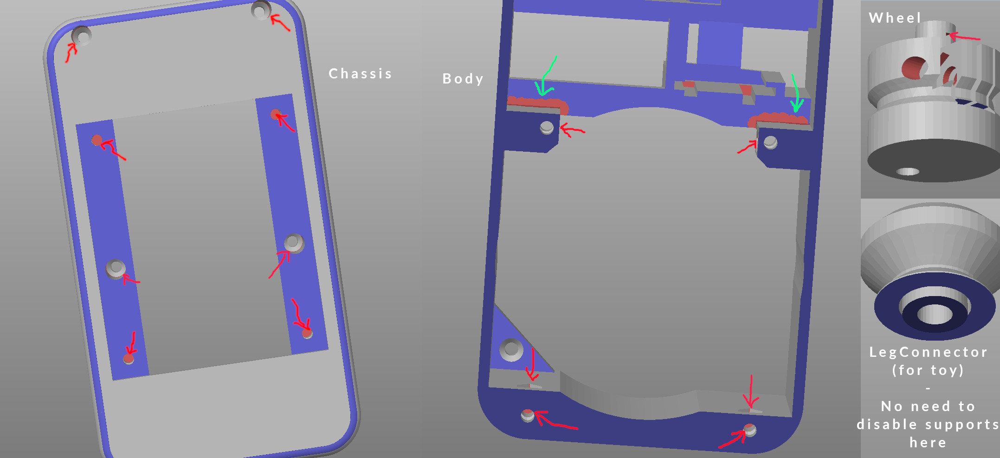

# Models
These are models to be 3D-printed for the robot. Basically you need to print each `.3mf` file once.
I use [PrusaSlicer](https://www.prusa3d.com/) for slicing and generating gcode.

## Editing
Probably (unless you happen to collect exactly the same [components](../README.md#shopping-list) as me) you'll need to edit
some parts. Currently I suggest using [toponaming](https://github.com/FreeCAD/FreeCAD/tree/development/toponaming) branch of
FreeCAD and (to prevent headaches) **not mapping anything on 3D features**, i.e. project only geometry from sketches and
use DatumPlanes and parametric expressions to achieve proper structure, otherwise recomputing hell will come upon you
with refernces jumping from one feature to another etc.

After editing and exporting the models, there is a `Reload from disk` feature in PrusaSlicer. After reloading from disk you will want to add supports to all overhangs under 40˚ and to disable supports at specific places where they are not actually needed and are
hard to tear off after parts have been printed

 * disabled surfaces are marked by red
 * some less visible surfaces are highlighted by red arrows
 * green arrows show areas that need to be also disabled to prevent support dilatation into problematic neighbouring pockets